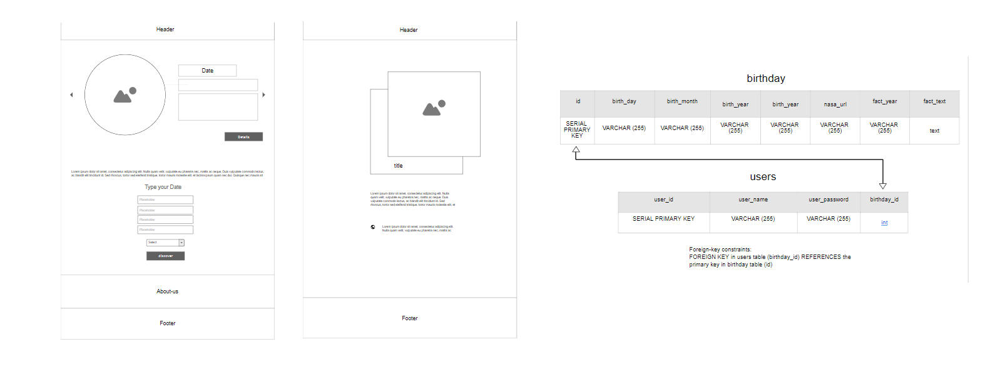

# Crystal  

As a child, growing up to shows like "The Jetsons" and movies like “Star Trek”, you grow up with the hopes that the future is filled with flying cars and space travel.
The sad reality is, in 2020 we are still not there yet. So, while people like Elon Musk and his team at SpaceX, work on getting us to that point, we created what we would call a space waiting room. Since we cannot actually take you to space, we thought we could bring a piece of space to you; using our website, through the power of APIs and some math, you can discover what NASA saw on your birthday, and you can also see how old you would be if you lived on a different planet. 

The minimum viable product (MVP) for this project is to have the user be able to search for the details related to their birthday.

## Delicioso Team Members

1. Dana Kiswani
2. Farah Zuot
3. Mahmoud Ghannam
4. Rania Abdullah
5. Sally Ammous

## Wireframe and Database Table

